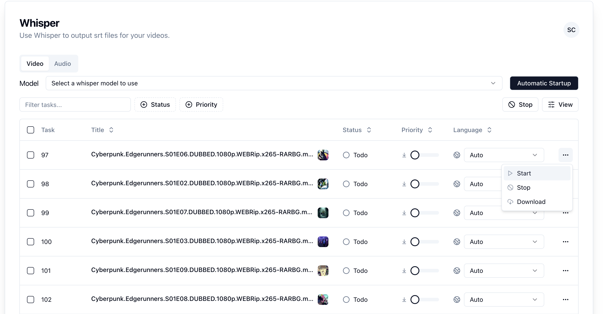

# GPT-Subtitle :speech_balloon: :globe_with_meridians:



[View Current Development Task](https://hqwuzhaoyi.notion.site/gpt-subtitle-b1eed463063a484f93bdfca91277fc3a?pvs=4) :clipboard:

GPT-Subtitle combines [Whisper](https://github.com/ggerganov/whisper.cpp) and [OpenAI](https://openai.com/)’s [GPT-3 Language Model](https://openai.com/gpt-3/) :brain:, offering you local translation functionality for audio and video. It not only translates subtitles into dialogues but also supports multiple language translations and allows you to conveniently translate subtitles into other languages. :artificial_satellite:

## :sparkles: Key Features:

By integrating the [whisper.cpp](https://github.com/ggerganov/whisper.cpp) model, you can now:

- Scan videos and audios in a folder and convert them into srt subtitle files :mag: :film_strip: :headphones:
- Utilize optimization algorithms to translate multi-language subtitle files :speech_balloon: :globe_with_meridians:

## :wrench: Tech Stack

- NextJS 13 (App Router)
- NestJS
- Jotai
- Framer Motion
- Radix UI
- Socket.IO
- TailwindCSS

## Running Environment

This project runs on the Node.js platform, so you need to install Node.js on your local machine first. After installation, open your command-line tool, navigate to the project root directory, and install pnpm and the necessary dependencies:

```sh
pnpm install
sh setup-whisper.sh
```

## Usage

### Setting up API KEY

Before using the translation feature, you need to register an account on the [OpenAI official website](https://beta.openai.com/signup/) and apply for an API KEY. After obtaining the API KEY, you can copy a `.env` file from `.env.template` in the root directory and add the following configuration:

```sh
OPENAI_API_KEY= // OpenAI API KEY
GOOGLE_TRANSLATE_API_KEY= // Google 翻译 API KEY 可以不填
BASE_URL= // OpenAI API URL
WEB_PORT=3000 // 前端端口
SERVER_PORT=3001  // 后端端口

STATIC_PATH=/static // 静态文件路径
OUTPUT_SRT_THEN_TRANSLATE=true // 是否先输出 SRT 文件再翻译
LANGUAGE=Chinese // 输出 SRT 文件再翻译语言

REDIS_PORT=6379 // Redis 端口
REDIS_HOST=localhost // Redis 地址
MYSQL_HOST=localhost // MySQL 地址
MYSQL_PORT=3306 // MySQL 端口
MYSQL_USER=root // MySQL 用户名
MYSQL_PASSWORD=123456 // MySQL 密码
MYSQL_DATABASE=gpt_subtitle // MySQL 数据库名

API_URL=http://localhost:3001 // 后端 API 地址
NEXT_PUBLIC_API_URL=http://localhost:3001 // 同上， 后端 API 地址
```

Replace `your_api_key` with your own API key.

### Running the Program

### Deploy the service locally:

```sh
npm run deploy:prod
```


## :whale: Docker Deployment

### :books: Using docker-compose

1. Change the arguments inside `docker-compose.yml`

2. Run the command

   ```
   docker-compose up -d
   ```

   

